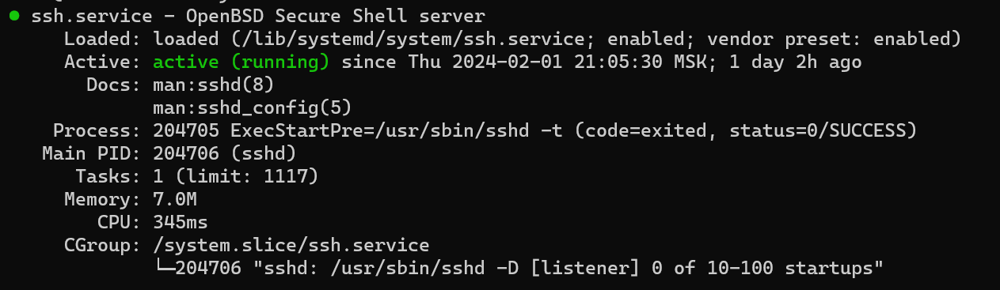
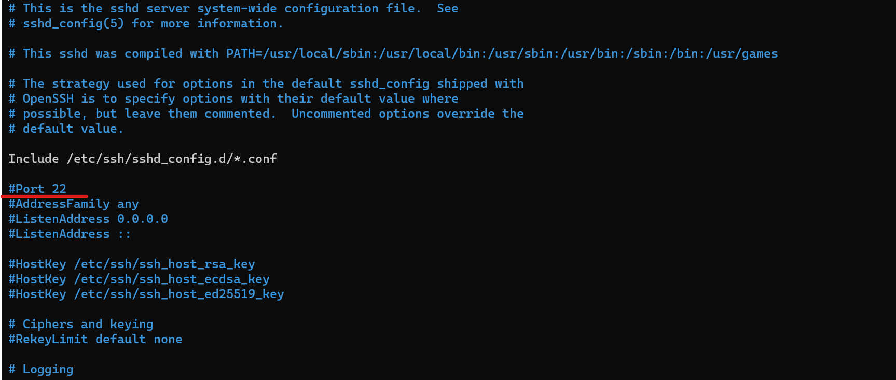
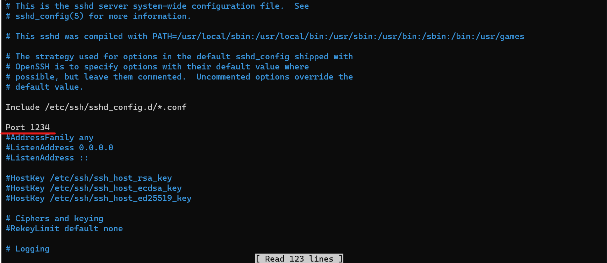

# Развертывание сайта

## Содержание

- [Подготовка системы](#подготовка-системы)
  - [Требования](#требования)
  - [Установка SSH-сервера](#установка-ssh-сервера)
  - [Настройка SSH-сервера](#настройка-ssh-сервера)
  - [Установка SSH на Windows 10/11](#установка-ssh-на-windows-1011)
- [Установка зависимостей](#установка-зависимостей)
  - [Nginx](#nginx)
  - [PostgreSQL](#postgresql)

## Подготовка системы

### Требования

- Удаленный сервер под Ubuntu 22.04 LTS

### Установка SSH-сервера

Обновить репозиторий:

```
$ sudo apt update
```

Установить SSH:

```
$ sudo apt-get install ssh
```

Установить SSH-сервер:

```
$ sudo apt install openssh-server
```

Добавить SSH-сервер в автозагрузку:

```
$ sudo systemctl enable sshd
```

Проверить работу SSH:

```
$ systemctl status sshd
```

Результат выполнения команды должен быть таким:



### Настройка SSH-сервера

Открыть файл конфигурации SSH-сервера:

```
$ sudo nano /etc/ssh/sshd_config
```



Раскомментировать строчку:

```
#Port 22
```

Желательно изменить порт на любой другой:



Перезапустить SSH-сервер:

```
systemctl restart sshd
```

### Установка SSH на Windows 10/11

Открыть Windows PowerShell от имени администратора

Установить SSH-клиент:

```
Add-WindowsCapability -Online -Name OpenSSH Client~~~~0.0.1.0
```

Проверить установку:

```
Get-WindowsCapability -Online | ? Name -like 'OpenSSH*'
```


## Установка зависимостей

Обновление доступных пакетов:

```
$ apt-get update
```

### Nginx

```
$ apt-get install nginx
```

### PostgreSQL

[Ссылка на гайд по установке на Ubuntu](https://www.postgresql.org/download/linux/ubuntu/)

## Установка сайта

Создаем папку с сайтом:

```
$ mkdir /var/www/new
```

Переходим в папку:

```
$ cd /var/www/engr.rudn.ru
```

```
$ git init
$ git pull https://github.com/EfremovEgor/engr.rudn.ru
```
