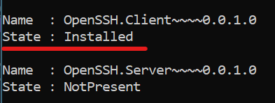

# Развертывание сайта

## Содержание

- [Подготовка системы](#подготовка-системы)
  - [Требования](#требования)
  - [Установка SSH-сервера](#установка-ssh-сервера)
  - [Настройка SSH-сервера](#настройка-ssh-сервера)
  - [Установка SSH на Windows 10/11](#установка-ssh-на-windows-1011)
- [Установка зависимостей](#установка-зависимостей)
  - [Nginx](#nginx)
  - [PostgreSQL](#postgresql)
  - [Python](#python)
- [Начальная установка сайта](#начальная-установка-сайта)
- [Настройка сайта](#настройка-сайта)
  - [Переменные среды](#переменные-среды)
  - [Миграции базы данных](#миграции-базы-данных)
  - [Статика](#статика)
- [Настройка и запуск Gunicorn](#настройка-и-запуск-Gunicorn)
  - [Создание gunicorn.service](#создание-gunicornservice)
  - [Создание gunicorn.socket](#создание-gunicornsocket)
  - [Запуск Gunicorn](#запуск-gunicorn)
- [Настройка и запуск Nginx](#настройка-и-запуск-nginx)
  - [sites-available и sites-enabled](#sites-available-и-sites-enabled)
  - [Запуск Nginx](#запуск-nginx)

## Подготовка системы

### Требования

- Удаленный сервер под Ubuntu 22.04 LTS

### Установка SSH-сервера

Обновить репозиторий:

```
$ sudo apt update
```

Установить SSH:

```
$ sudo apt-get install ssh
```

Установить SSH-сервер:

```
$ sudo apt install openssh-server
```

Добавить SSH-сервер в автозагрузку:

```
$ sudo systemctl enable sshd
```

Проверить работу SSH:

```
$ systemctl status sshd
```

Результат выполнения команды должен быть таким:


### Настройка SSH-сервера

Открыть файл конфигурации SSH-сервера:

```
$ sudo nano /etc/ssh/sshd_config
```


Раскомментировать строчку:

```
#Port 22
```

Желательно изменить порт на любой другой:


Перезапустить SSH-сервер:

```
systemctl restart sshd
```

### Установка SSH на Windows 10/11

Открыть Windows PowerShell от имени администратора

Установить SSH-клиент:

```
Add-WindowsCapability -Online -Name OpenSSH Client~~~~0.0.1.0
```

Проверить установку:

```
Get-WindowsCapability -Online | ? Name -like 'OpenSSH*'
```



## Установка зависимостей

Обновить доступных пакетов:

```
$ apt-get update
```

### Nginx

```
$ apt-get install nginx
```

### Python

```
$ sudo apt install python3-pip
```

### PostgreSQL

[Ссылка на гайд по установке на Ubuntu](https://www.postgresql.org/download/linux/ubuntu/)

## Начальная установка сайта

Создать папку с сайтом:

```
$ mkdir /var/www/new
```

Перейти в папку:

```
$ cd /var/www/engr.rudn.ru
```

```
$ git init
```

```
$ git pull https://github.com/EfremovEgor/engr.rudn.ru
```

Установить зависимости:

```
$ pip install -r requirements.txt
```

## Настройка сайта

### Переменные среды

Создать .env файл и заполнить его:

```
$ make create_env
```

или создать самому:

```
$ nano .env
```

Пример:

```
DJANGO_DATABASE_HOST= localhost
DJANGO_DATABASE_PORT= 5432
DJANGO_DATABASE_NAME= engr.rudn.ru
DJANGO_DATABASE_USER= postgres
DJANGO_DATABASE_PASSWORD= postgres
PROMETHEUS_URL_SUFFIX= random_base64_string_url_safe
```

### Миграции базы данных

```
$ cd src
```

```
$ python3 manage.py migrate
```

### Статика

```
$ cd src
```

```
$ python3 manage.py collectstatic
```

## Настройка и запуск Gunicorn

```
$ cd /etc/systemd/system/
```

### Создание gunicorn.service

Создать gunicorn.service:

```
$ nano gunicorn.service
```

Заполнить файл:

```
[Unit]
Description=gunicorn daemon
Requires=gunicorn.socket
After=network.target

[Service]
User=root
Group=www-data
WorkingDirectory=/var/www/engr.rudn.ru/src
ExecStart=gunicorn \
          --access-logfile - \
          --workers 3 \
          --bind unix:/run/gunicorn.sock \
          engr_rudn.wsgi:application

[Install]
WantedBy=multi-user.target
```

### Создание gunicorn.socket

Создать gunicorn.socket:

```
$ nano gunicorn.socket
```

Заполнить файл:

```
[Unit]
Description=gunicorn socket

[Socket]
ListenStream=/run/gunicorn.sock

[Install]
WantedBy=sockets.target
```

### Запуск Gunicorn

Проверить gunicorn.service на наличие ошибок(если все хорошо, ничего не выводит в консоль):

```
$ systemd-analyze verify gunicorn.service
```

Запустить gunicorn:

```
sudo systemctl enable gunicorn
sudo systemctl start gunicorn
```

## Настройка и запуск Nginx

### sites-available и sites-enabled

```
$ cd /etc/nginx/sites-available/
```

Создать файл:

```
$ nano engr
```

Заполнить файл:

```
server {
    listen 80;
    server_name 89.111.152.60;

    location /favicon.ico {
        access_log off; log_not_found off;
    }
    location /static/ {
        alias /var/www/site/src/staticfiles/;
    }
    location /media/ {
        alias /var/www/site/src/uploads/;
    }

    location / {
        proxy_pass http://unix:/run/gunicorn.sock;
        proxy_set_header X-Forwarded-For $proxy_add_x_forwarded_for;
        proxy_set_header Host $server_name;
        proxy_set_header X-Real-IP $remote_addr;
    }
}
```

Создать символическую ссылку на файл в каталоге

```
sudo ln -s /etc/nginx/sites-available/engr /etc/nginx/sites-enabled/
```

### Запуск Nginx

```
sudo nginx -t
```

Теперь сайт доступен по внешнему IP вашего сервера
