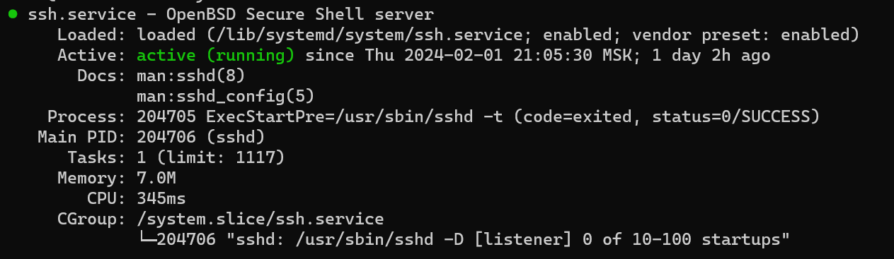

# Развертывание сайта

## Требования

- Удаленный сервер под Ubuntu 22.04 LTS

## Установка ssh

```
$ sudo apt update
```

```
$ sudo apt-get install ssh
```

```
$ sudo apt install openssh-server
```

```
$ sudo systemctl enable sshd
```

```
$ systemctl status sshd
```

Результат выполнения команды должен быть таким:

